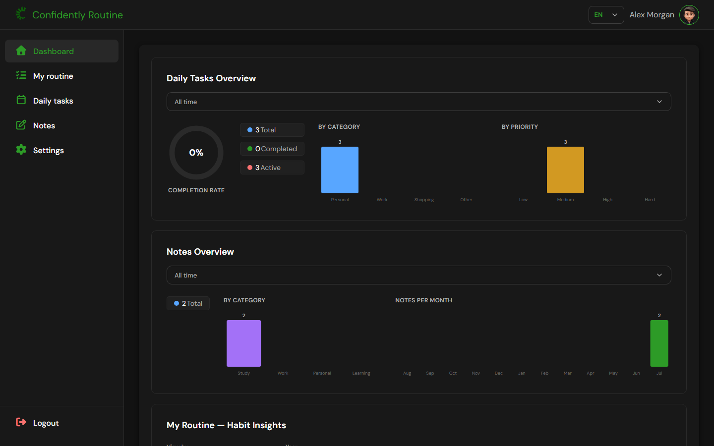
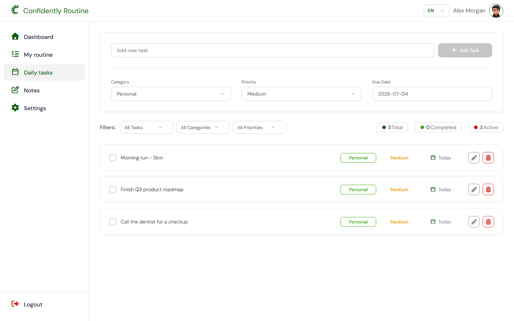
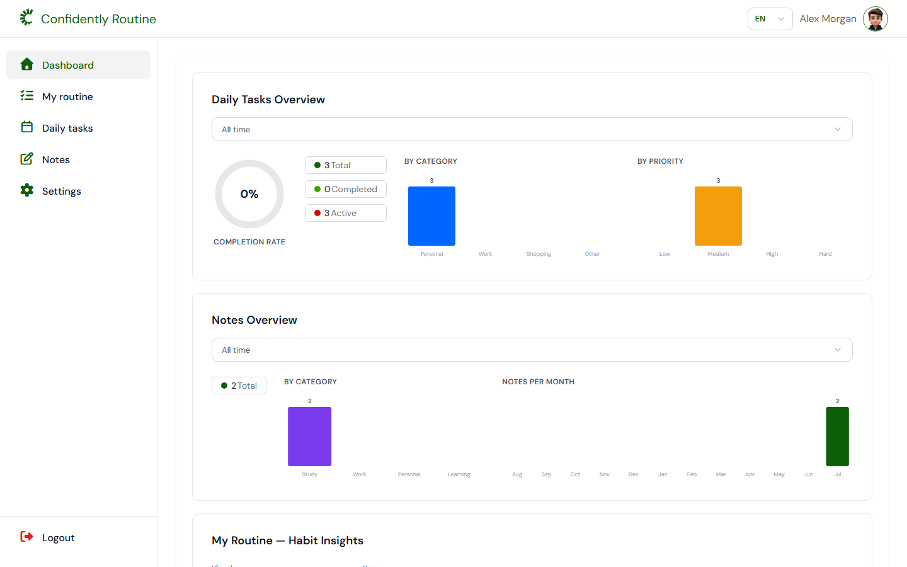
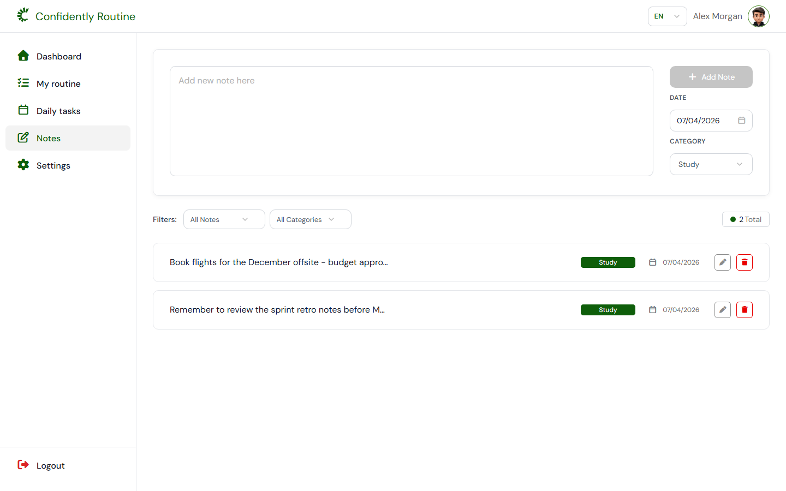
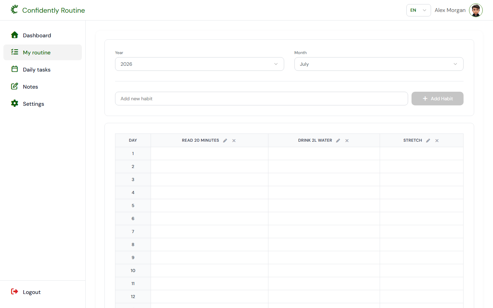
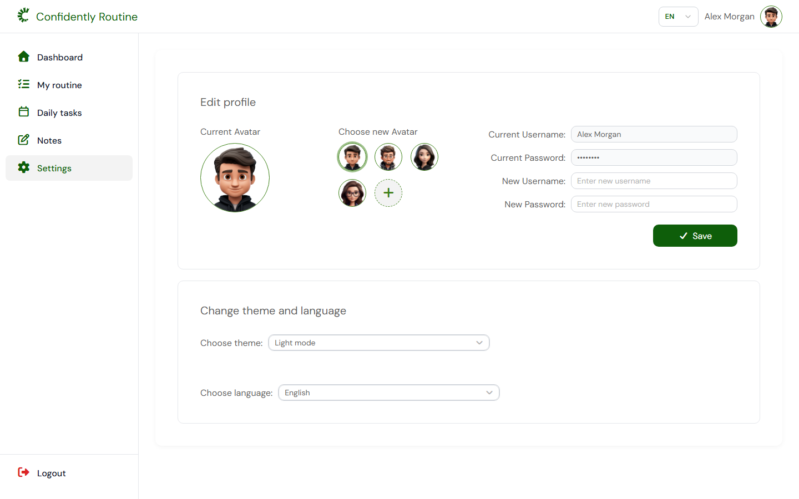
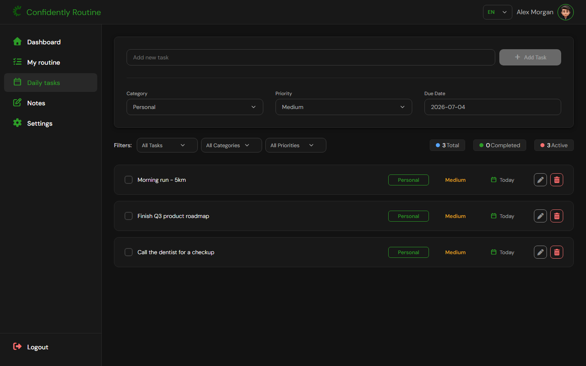
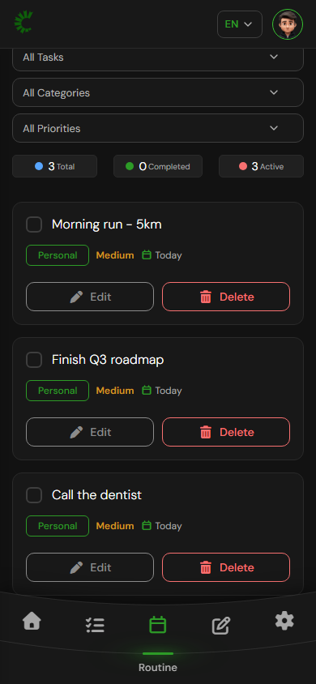
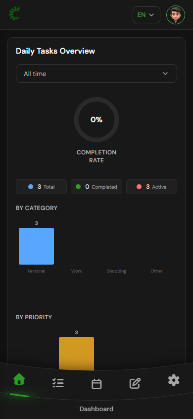

<div align="center">


# Confidently Routine

### Build habits. Track tasks. Capture ideas. Everywhere.

A privacy-first productivity suite for habits, daily tasks, and notes — built with **SolidJS + Tailwind CSS v4** and packaged with **Tauri v2 (Rust)** as a native app for **Windows, macOS, Android, and iOS**, while still running as a plain web page in any browser.

<br />

[](https://github.com/HRuler19/Confidently-Routine/releases/latest)
[](#-download--install)
[](#-tech-stack)
[](#-tech-stack)
[](#-tech-stack)
[](#-license)

<br />

**[⬇ Download](#-download--install)** &nbsp;·&nbsp; **[✨ Features](#-features)** &nbsp;·&nbsp; **[📸 Screenshots](#-screenshots)** &nbsp;·&nbsp; **[🏗 Architecture](#-architecture)** &nbsp;·&nbsp; **[🛠 Build from source](#-building-from-source)**

</div>

<br />

<div align="center">
  
</div>

<br />

---

## 📖 Overview

**Confidently Routine** is a self-contained personal-productivity application that unifies three everyday tools — a **habit tracker**, a **daily task manager**, and a **notes board** — behind a single analytics **dashboard**. It is built on SolidJS's fine-grained reactivity with a Rust-powered Tauri shell, stores all data locally on the device, and ships to every major platform from a single shared codebase — with a desktop installer around **5 MB**.

| | |
|---|---|
| 🔒 **Private by design** | Every task, habit, and note lives in your device's local storage. No account, no server, no telemetry, no cloud. |
| 🖥 **Truly cross-platform** | One codebase → native Windows `.exe`, macOS `.dmg`, Android `.apk`, iOS app, **and** a browser app. |
| 🌗 **Light & dark themes** | A hand-tuned dark palette (near-black surfaces, brand-matched green accent) alongside the classic light theme. |
| 🌍 **Multilingual** | Full UI translation for **English, Türkçe, Türkmençe, and Русский**, switchable on the fly. |
| 📊 **Real analytics** | Dependency-free SVG charts turn your tasks, notes, and habits into completion rates, category breakdowns, and trends. |
| 📱 **Responsive** | A dedicated mobile layout with a custom curved bottom navigation bar, tuned from 320 px up to desktop. |

<br />

## ⬇ Download & Install

<!-- All three buttons use /releases/latest/download/<exact-filename>, which always
     serves whatever asset by that name sits in the newest release. tauri-action
     names the Windows/macOS files from productName + version (and GitHub replaces
     spaces in uploaded filenames with dots), and the Android APK is uploaded by hand
     under a fixed Confidently-Routine-<version>.apk pattern - so bump the version
     number in all three links whenever a new tag is released, or the buttons 404
     against the new release. -->

> Grab the latest build for your device from the **[latest release](https://github.com/HRuler19/Confidently-Routine/releases/latest)**, or use a direct link below — the buttons always resolve to the newest build, no need to hunt for a version number.

<div align="center">

### 🪟 Windows

[](https://github.com/HRuler19/Confidently-Routine/releases/latest/download/Confidently.Routine_2.0.1_x64-setup.exe)

### 🤖 Android

[-3DDC84?style=for-the-badge&logo=android&logoColor=white)](https://github.com/HRuler19/Confidently-Routine/releases/latest/download/Confidently-Routine-2.0.1.apk)

### 🍎 macOS

[-000000?style=for-the-badge&logo=apple&logoColor=white)](https://github.com/HRuler19/Confidently-Routine/releases/latest/download/Confidently.Routine_2.0.1_universal.dmg)

### 📱 iOS


</div>

### Installation notes per platform

| Platform | File | How to install |
|---|---|---|
| **Windows** | `Confidently.Routine_2.0.1_x64-setup.exe` | Run the ~5 MB installer — it adds Start-menu and desktop shortcuts. Installs per-user, no admin rights needed. |
| **Android** | `Confidently-Routine-2.0.1.apk` | Enable **Settings → Apps → Install unknown apps** for your browser/file manager, then open the `.apk` to sideload. Signed release build (arm64 + x86_64). |
| **macOS** | `Confidently.Routine_2.0.1_universal.dmg` | Open the `.dmg`, drag the app into **Applications**. Single universal binary — works on both Apple Silicon and Intel Macs, built automatically by CI on every tagged release. |
| **iOS** | — | Apple doesn't allow installing an unsigned `.ipa` on a device without a paid Developer Program account, so there's no direct download yet. Build and run it yourself from Xcode — see [Building from source](#-building-from-source). |
| **Browser** | — | `bun install && bun run build`, then host the generated `dist/` folder on any static server. |

> ℹ️ **Windows SmartScreen / Android Play Protect / macOS Gatekeeper** may warn that the app is unsigned — the binaries are not yet code-signed with a paid certificate. Choose **More info → Run anyway** (Windows), **Install anyway** (Android), or **right-click → Open** (macOS) to proceed.

<br />

## ✨ Features

### 🎯 Daily Tasks
- Create tasks with a **category** (Personal, Work, Shopping, Other), a **priority** (Low, Medium, High, Hard), and a **due date** via an inline calendar.
- **Filter** by status, category, or priority; inline **edit** and **delete** with a confirmation modal.
- Live **counters** for total / completed / active tasks.

### 📅 My Routine (Habit Tracker)
- Track any number of habits on a **month-by-month grid**, one column per habit and one row per day.
- Mark each day complete (✓), missed (✗), or with a numeric count.
- Includes a **sleep chart** to visualize rest over the month.

### 🗒 Notes
- Rich, categorized notes (Study, Work, Personal, Learning) with dates.
- **Filter** by category or date, edit and delete in place.

### 📊 Dashboard
- **Task analytics** — completion-rate ring, plus category and priority breakdowns.
- **Notes analytics** — totals, category split, and notes-per-month trend.
- **Habit insights** — per-habit statistics with month/year views.
- All charts are **hand-written SVG** — no charting library, fully theme-aware.

### ⚙️ Settings & Personalization
- Edit profile (username, password, avatar) with a set of built-in avatars.
- Switch **theme** (Light / Dark) and **language** (EN / TR / TK / RU) instantly.

<br />

## 📸 Screenshots

<div align="center">

### Desktop — Light



<em>Daily Tasks — categorized, prioritized, and filterable</em>

<br /><br />



<em>Dashboard — real analytics for tasks, notes, and habits</em>

<br /><br />

<table>
  <tr>
    <td width="50%"></td>
    <td width="50%"></td>
  </tr>
  <tr>
    <td align="center"><em>Notes board</em></td>
    <td align="center"><em>Habit tracker grid</em></td>
  </tr>
  <tr>
    <td width="50%"></td>
    <td width="50%"></td>
  </tr>
  <tr>
    <td align="center"><em>Settings & personalization</em></td>
    <td align="center"><em>Tasks in dark mode</em></td>
  </tr>
</table>

### Mobile — Dark

<table>
  <tr>
    <td width="50%" align="center"></td>
    <td width="50%" align="center"></td>
  </tr>
  <tr>
    <td align="center"><em>Tasks with the custom curved bottom nav</em></td>
    <td align="center"><em>Dashboard on a phone</em></td>
  </tr>
</table>

</div>

<br />

## 🧰 Tech Stack

| Layer | Technology | Notes |
|---|---|---|
| **UI framework** | [SolidJS](https://www.solidjs.com/) + [Solid Router](https://github.com/solidjs/solid-router) | Fine-grained reactivity — no virtual DOM, surgical updates. |
| **Styling** | [Tailwind CSS v4](https://tailwindcss.com/) | Design tokens exposed as utilities; light/dark themes flip via CSS variables. |
| **Language** | TypeScript | Strict mode across the whole `src/` tree. |
| **Runtime / PM** | [Bun](https://bun.sh/) | Package manager + script runner. |
| **Bundling** | [Vite](https://vite.dev/) | Dev server + production build (~38 KB gzipped JS). |
| **Charts** | Custom SVG components (`src/components/charts.tsx`) | Dependency-free, responsive, theme-aware. |
| **Persistence** | `localStorage` | Reactive store layer (`src/lib/stores.ts`); v1 data keys are fully compatible. |
| **Desktop shell** | [Tauri v2](https://v2.tauri.app/) (Rust) | Native WebView — the installer is **~5 MB** (vs ~80 MB with Electron). |
| **Mobile shell** | [Tauri v2 Mobile](https://v2.tauri.app/) | Native Android & iOS wrappers around the same frontend. |
| **Icons / Fonts** | Font Awesome 7, DM Sans | Loaded via CDN. |

<br />

## 🏗 Architecture

The application is organized into clean, single-responsibility layers driven by Solid's fine-grained reactivity — data signals flow from the store layer straight into components, so there is no event bus and no manual re-rendering.

```
┌─────────────────────────────────────┐
│           Pages & Components         │  SolidJS + Solid Router (login guard, 5 pages)
├─────────────────────────────────────┤
│          Reactive Signals            │  i18n · theme · store signals (auto re-render)
├─────────────────────────────────────┤
│             Data Layer               │  localStorage-backed reactive stores
├─────────────────────────────────────┤
│         Visualization Layer          │  Dependency-free SVG chart components
└─────────────────────────────────────┘
```

**How native packaging works:** one Vite-built frontend (`dist/`) powers every target. Tauri embeds it in the platform's native WebView with a Rust core — no bundled browser engine, which is why the binaries stay tiny:

```
                         ┌────────────────────────────┐
   Shared frontend  ──▶  │   SolidJS + Tailwind v4    │
   (no per-platform code)│   Vite build → dist/       │
                         └──────────────┬─────────────┘
                    ┌───────────────────┼───────────────────┐
                    ▼                   ▼                   ▼
            ┌──────────────┐   ┌────────────────┐   ┌──────────────┐
            │  Tauri v2    │   │ Tauri v2 Mobile│   │   Browser    │
            │ (Win / macOS)│   │ (Android / iOS)│   │  (any host)  │
            └──────────────┘   └────────────────┘   └──────────────┘
```

<br />

## 📂 Project Structure

```
Confidently-Routine/
├─ index.html                 # Vite entry (theme pre-paint script + fonts)
├─ vite.config.ts             # Vite + Solid + Tailwind v4 plugins
├─ tsconfig.json
│
├─ src/
│  ├─ index.tsx               # App bootstrap
│  ├─ App.tsx                 # Router + auth guard
│  ├─ pages/                  # Login · Dashboard · MyRoutine · Tasks · Notes · Settings
│  ├─ components/             # Layout · Header · Sidebar · MobileNav · Select · ConfirmModal · charts
│  ├─ lib/                    # stores (reactive persistence) · i18n · theme · translations
│  └─ styles/app.css          # Tailwind v4 theme tokens + bespoke curved-nav CSS
│
├─ src-tauri/                 # Tauri v2 (Rust) — desktop & mobile shells
│  ├─ tauri.conf.json         # Window, bundle & identifier config
│  ├─ src/                    # Rust entry points
│  ├─ icons/                  # Generated app icons (all platforms)
│  └─ gen/android/            # Generated Android (Gradle) project
│
├─ public/images/             # Logo & avatars
├─ appicon-src/               # Source logo for icon generation
└─ docs/                      # README assets (logo + screenshots)
```

<br />

## 🛠 Building from Source

### Prerequisites
- **[Bun](https://bun.sh/)** (package manager & script runner)
- **[Rust](https://rustup.rs/)** (stable) — required for the Tauri desktop/mobile shells
- Platform-specific toolchains (see each section below)

### Setup
```bash
git clone https://github.com/HRuler19/Confidently-Routine.git
cd Confidently-Routine
bun install
```

### Run in a browser (dev server)
```bash
bun run dev               # Vite dev server at http://localhost:1420
```

### Run the desktop app (dev, hot reload)
```bash
bun run tauri dev
```

### Build targets

| Target | Command | Requirements | Output |
|---|---|---|---|
| 🪟 **Windows** | `bun run dist:win` | MSVC Build Tools + Windows SDK | `src-tauri/target/release/bundle/nsis/*.exe` (~5 MB) |
| 🍎 **macOS** | `bun run dist:mac` | a Mac with Xcode CLT | `src-tauri/target/release/bundle/…` (`.dmg`/`.app`) |
| 🤖 **Android** | `bun run dist:android` | Android SDK + NDK + JDK 21 | `src-tauri/gen/android/app/build/outputs/apk/…` |
| 📱 **iOS** | `bun run tauri ios build` | a Mac with Xcode | `.ipa` via Xcode |
| 🌐 **Browser** | `bun run build` | — | static `dist/` for any web host |

<details>
<summary><strong>🪟 Windows build notes</strong></summary>

<br />

- Requires the **Visual Studio Build Tools** C++ workload (MSVC + Windows SDK) for the Rust MSVC toolchain.
- The NSIS installer is produced unsigned; SmartScreen will warn until a code-signing certificate is configured.
</details>

<details>
<summary><strong>🤖 Android build notes</strong></summary>

<br />

- Requires **JDK 21**, the Android SDK (`platform-tools`, `platforms;android-34`, `build-tools;34.0.0`) and the **NDK** (r27+), plus the Rust Android targets:

```bash
rustup target add aarch64-linux-android armv7-linux-androideabi i686-linux-android x86_64-linux-android
```

- Set `JAVA_HOME`, `ANDROID_HOME` and `NDK_HOME` before building.
- On Windows, Tauri links the built Rust library into the Gradle project via a **symlink**, which requires either **Developer Mode** or an elevated (administrator) terminal.
</details>

<details>
<summary><strong>🍎 macOS / iOS build notes</strong></summary>

<br />

Apple's toolchain (Xcode, code signing, the simulator) **only runs on macOS** — this is an Apple platform restriction, not a limitation of this project. On a Mac:

```bash
bun install
bun run tauri ios init    # generate the Xcode project (first time only)
bun run tauri ios build   # or: bun run tauri ios dev
```

In Xcode, under the app target's **Signing & Capabilities** tab, sign in with your Apple ID and pick it as the **Team** (a free personal account is enough to run on the Simulator or your own device — no paid Developer Program needed for that).

For macOS desktop, `bun run dist:mac` produces the `.app`/`.dmg` bundles.
</details>

<details>
<summary><strong>🎨 Regenerating app icons</strong></summary>

<br />

Edit `appicon-src/logo.png`, then regenerate every platform's icons in one shot:

```bash
bun run tauri icon appicon-src/logo.png
```
</details>

<br />

## 🌍 Internationalization

The entire UI is translated through a single dictionary (`src/lib/translations.ts`) and applied by a reactive i18n helper (`src/lib/i18n.ts`). Switching languages re-renders every page instantly.

| Language | Code | Status |
|---|---|---|
| 🇬🇧 English | `en` | ✅ Complete |
| 🇹🇷 Türkçe | `tr` | ✅ Complete |
| 🇹🇲 Türkmençe | `tk` | ✅ Complete |
| 🇷🇺 Русский | `ru` | ✅ Complete |

<br />

## 🗺 Roadmap

- [x] Windows desktop app (Tauri v2 — ~5 MB installer)
- [x] Android app (Tauri v2 Mobile)
- [x] macOS `.dmg` build (Apple Silicon & Intel)
- [x] Dark mode & full responsive mobile layout
- [x] Multi-language support (EN / TR / TK / RU)
- [x] Real dashboard analytics
- [ ] iOS App Store submission (requires a paid Apple Developer account)
- [ ] Signed Windows, macOS & Play Store releases
- [ ] Offline-first Service Worker (installable PWA)
- [ ] Optional cloud sync via an adapter layer
- [ ] CSV / calendar export

<br />

## 🤝 Contributing

Contributions are welcome. Fork the repo, create a feature branch, and open a pull request. Please keep the dependency-light spirit of the codebase and match the existing code style.

<br />

## 📄 License

Released under the **MIT License** — free to use, modify, and distribute.

<br />

---

<div align="center">

**Confidently Routine** — one app, every device.

Built with SolidJS, Tailwind CSS v4, Tauri v2, and Bun.

⭐ Star this project if it helps you stay on track!

<br />

© 2026 Confidently Routine. All rights reserved.

</div>
